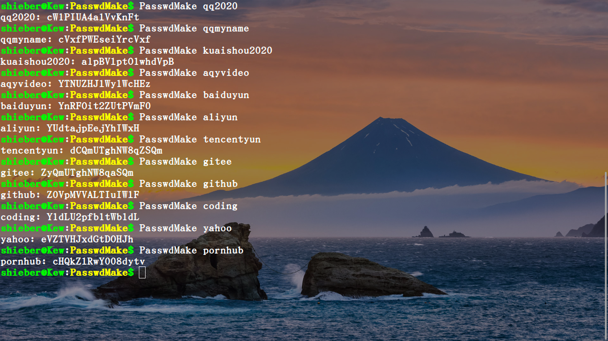

# PasswdMake
:experimental:
:author: 'Shieber'
:date: '2020.07.31'

### [link:README_CN.adoc[中文]] Make a password for any account via a seed.

### Usage1

[source, shell]
.bash
----
    $ go run PasswdMake.go seed
    $ go run PasswdMake.go alipayxjp
    $ go run PasswdMake.go wechatxjp
    $ go run PasswdMake.go zhihuxjp
    $ go run PasswdMake.go weiboxjp
----

### Usage2 [Add PasswdMake.go to /usr/local/bin]

[source, shell]
.bash
-----
    $ go build PasswdMake.go 
    $ chmod +x PasswdMake
    $ sudo mv PasswdMake /usr/local/bin
    $ PasswdMake seed
-----

### Example

image::./passwdmake.png[passwordmk.png]

### Use pass to save the long-complex password as below

[source, shell]
.bash
-----
    $ sudo apt install pass
-----

